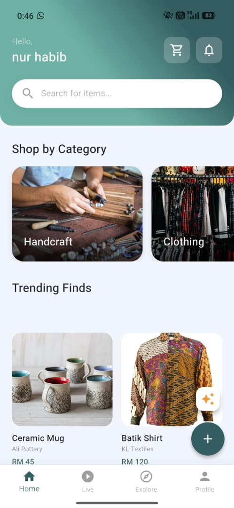
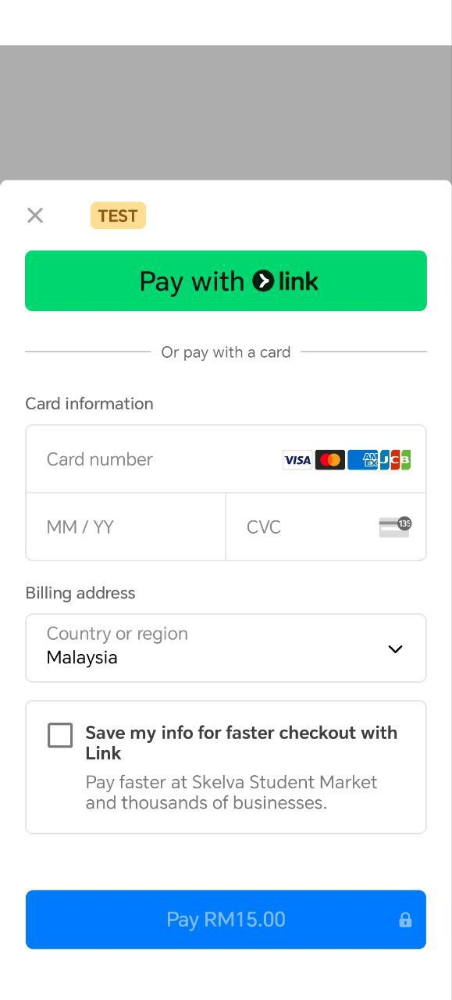

# 🌿 Skelva: The Ultimate Student Marketplace & Community App

Skelva is a specialized mobile application developed to promote digital entrepreneurship among university students. By bridging the gap between social media and commercial e-commerce, Skelva provides a secure, verified, and interactive "Campus Super-App Ecosystem" tailored specifically for student needs.

---

## 🚀 The Problem We Solve
Existing platforms like Shopee and Lazada are highly commercialized and lack support for service-based listings. Meanwhile, managing sales through WhatsApp or TikTok DMs is disorganized and lacks a trust verification system for campus logistics. 

**Skelva** solves this by offering a hybrid marketplace where students can monetize both their physical products (e.g., food, thrifted clothes) and technical skills (e.g., PC formatting, coding, design) in a secure, university-verified environment.

---

## ✨ Key Features

* 🛒 **Hybrid Listings:** A unified marketplace supporting both physical goods and technical services.
* 🎥 **Live Commerce (1080p):** Integrated with ZegoCloud, allowing sellers to broadcast real-time demonstrations of their services or products to build buyer trust.
* 💳 **Secure Cashless Payments:** Fully integrated with Stripe for seamless, secure checkout experiences.
* 🎮 **Arcade Center (Gamification):** Built-in game loop featuring "Space Defender" (Meteor Shooter) and "Spin & Win" where users play to earn Skelva Coins, driving daily app retention.
* 🔐 **Role-Based Access Control (RBAC):** Strict verification separates "Buyers" from "Verified Sellers," ensuring a safe campus ecosystem.
* 📦 **Professional Order Management:** Real-time tracking of order lifecycles (To Pay, To Ship, To Receive, Completed) mimicking industry standards.
* 🤖 **AI Assistant:** "SkelvaBot" provides automated customer support and product recommendations.

---

## 🛠️ Tech Stack

### Frontend
* **Framework:** Flutter (Dart)
* **State Management:** Provider / setState
* **UI/UX:** Figma (Prototyping & Wireframing)

### Backend
* **Database:** Google Cloud Firestore (NoSQL) for real-time data sync.
* **Authentication:** Firebase Auth (Email/Password & Google Sign-In).
* **Storage:** Firebase Cloud Storage for product and profile images.

### Third-Party APIs
* **ZegoCloud:** Live Streaming SDK for Host/Audience synchronization.
* **Stripe:** Sandbox Testing Payment Gateway API.

---

## 🏗️ Architecture & Methodology
Skelva was developed using an **Agile Methodology**, utilizing iterative prototype development and User Acceptance Testing (UAT). 

The system utilizes a client-server architecture where the Flutter frontend communicates asynchronously with Firebase. Complex operations, such as dynamic Room ID synchronization for live streams and collision detection in the game loop, are handled efficiently to maintain a smooth 60 FPS experience.

---

## 📸 Screenshots
*(Note: Upload your UI screenshots to an `assets` folder in your GitHub repo to display them here)*

| Home Dashboard | Live Commerce | Arcade Center | Checkout & Payment |
| :---: | :---: | :---: | :---: |
|  |  |  |  |

---

## 📥 Try the Prototype (Android APK)

> **⚠️ Academic Project Disclaimer:** > *Skelva is a my project for academic purposes at the Faculty of Computer Science and Information Technology (FSKTM), UTHM. This is a prototype build and **not an official commercial release**. The app is currently in its testing phase (UAT).*

If you would like to test the application's features, you can download the prototype APK for Android devices:

**Step 1: Download the Prototype**
* Go to the [Releases page](../../releases/ of this repository.
* Go to Apk release and go to google drive link and download the `skelva-prototype-v1.0.apk` file to your Android device.

**Step 2: Enable Installation**
* Because this is a developer prototype and not on the Google Play Store, you need to allow installation from unknown sources.
* Go to your phone's **Settings > Security** and enable **"Allow from this source"** for your file manager or browser.

**Step 3: Install & Explore**
* Open the downloaded `.apk` file and tap **Install**.
* Launch the app! You can register a test account (use any email format) to explore the Buyer, Seller, Live Streaming, and Gamification interfaces.

*(Note: Please do not use real credit card information during checkout; the Stripe integration is currently running in **Test Mode** for demonstration purposes.)*
